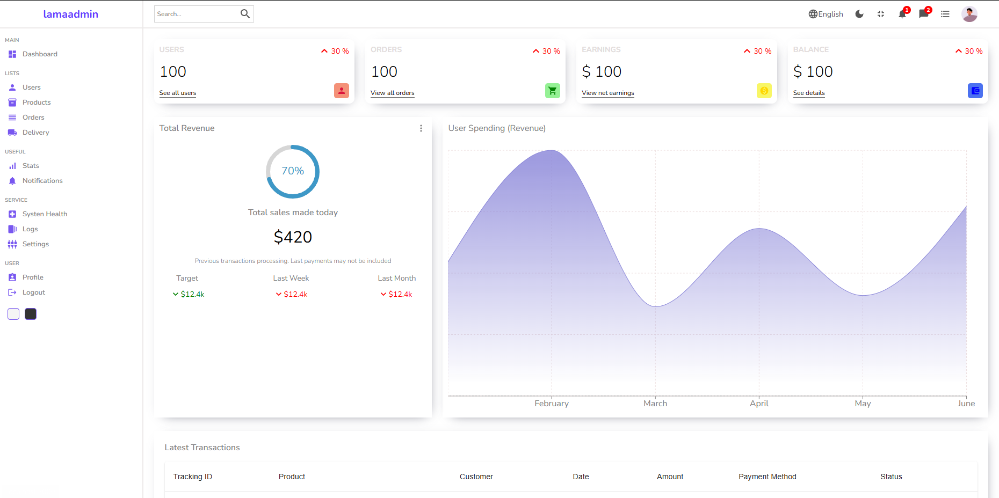

# 📝 Booking-App-exercise

A simple React app built for practicing CSS styling, layout techniques, and component design.  
This project focuses on experimenting with different CSS approaches in React.

---

## 📸 Screenshot



---

## 🚀 Run Locally

```bash
git clone https://github.com/yourusername/project-name.git
cd app
npm install
npm start
